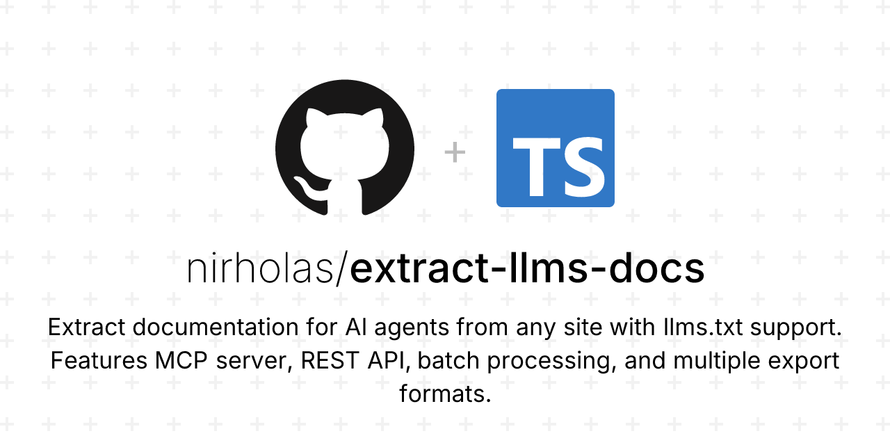

# llm.energy

<p align="center">
  
</p>

<p align="center">
  <strong>Extract llms.txt documentation and install.md instructions from any website for AI agents, LLMs, and automation workflows.</strong>
</p>

<p align="center">
  <a href="https://llm.energy"></a>
  <a href="https://llm.energy/docs/"></a>
  <a href="https://www.npmjs.com/package/@llm-energy/mcp-server"></a>
</p>

<p align="center">
  
  
  
  
</p>

## 📖 Overview

llm.energy is a web application and MCP server that fetches, parses, and organizes documentation from websites implementing the llms.txt and install.md standards. It transforms raw documentation into structured, agent-ready formats optimized for large language models, AI assistants, and developer tooling.

| Standard | Description | Learn More |
|----------|-------------|------------|
| **llms.txt** | Machine-readable documentation for AI systems | [llmstxt.org](https://llmstxt.org) |
| **install.md** | LLM-executable installation instructions | [installmd.org](https://installmd.org) |

---

## ✨ Key Features

| Feature | Description |
|---------|-------------|
| 🔍 **Smart Detection** | Automatically finds `llms.txt`, `llms-full.txt`, and `install.md` |
| 📄 **Organized Output** | Splits content into individual markdown files by section |
| 🤖 **Agent-Ready** | Includes `AGENT-GUIDE.md` optimized for AI assistants |
| 📦 **Multiple Formats** | Export as Markdown, JSON, YAML, or ZIP archive |
| 🔌 **MCP Server** | Integrate with Claude Desktop, Cursor, and more |
| ⚡ **Batch Processing** | Process multiple URLs simultaneously |
| 📚 **Site Directory** | Browse 19+ curated llms.txt-enabled websites |
| ✏️ **llms.txt Generator** | Create your own llms.txt files with a guided wizard |
| 🚀 **install.md Generator** | AI-powered: generate from GitHub repos, docs URLs, or manually |

---

## 🎯 Use Cases

```
┌─────────────────────────────────────────────────────────────────┐
│                                                                 │
│   📝 Feed docs to AI coding assistants (Cursor, Windsurf)      │
│   🤖 Build context-aware AI agents with up-to-date docs        │
│   🔄 Create documentation pipelines for RAG systems            │
│   📦 Aggregate docs from multiple sources automatically        │
│   ✏️  Generate llms.txt/install.md for your own projects       │
│   🚀 Auto-generate install.md from any GitHub repo             │
│                                                                 │
└─────────────────────────────────────────────────────────────────┘
```

---

## 🚀 install.md Generator

Generate LLM-executable installation instructions from any source:

| Mode | Description | Use Case |
|------|-------------|----------|
| **From GitHub** | Analyze any public GitHub repo and generate install.md | Perfect for creating install.md for existing projects |
| **From URL** | Extract from any documentation page | Convert existing docs to install.md format |
| **Manual** | Build from scratch with guided wizard | Full control over every detail |

### How It Works

1. **GitHub Mode**: Analyzes README, package.json/pyproject.toml/Cargo.toml, GitHub Actions, and releases
2. **URL Mode**: Scrapes documentation pages, detects platforms (Mintlify, Docusaurus, GitBook, etc.)
3. **AI Synthesis**: Uses Claude to generate a properly formatted install.md

### Quick Example

```bash
# Generate install.md for any GitHub project
curl -X POST https://llm.energy/api/generate-install \
  -H "Content-Type: application/json" \
  -d '{"url": "https://github.com/anthropics/anthropic-sdk-python", "type": "github"}'
```

Visit **[llm.energy/install-generator](https://llm.energy/install-generator)** to use the web interface.

---

## 📚 Documentation

Full documentation is available at **[llm.energy/docs](https://llm.energy/docs/)**

---

## 🚀 Installation

### Web Application

Visit [llm.energy](https://llm.energy) to use the hosted version.

### Local Development

```bash
# Clone the repository
git clone https://github.com/nirholas/extract-llms-docs.git
cd extract-llms-docs

# Install dependencies
pnpm install

# Start development server
pnpm dev
```

🌐 The application runs on **http://localhost:3001**

### MCP Server

<details>
<summary>📦 <strong>Click to expand MCP Server setup</strong></summary>

Add to your MCP client configuration (Claude Desktop, Cursor, etc.):

```json
{
  "mcpServers": {
    "llm-energy": {
      "command": "npx",
      "args": ["-y", "@llm-energy/mcp-server"]
    }
  }
}
```

See [MCP Server Documentation](https://llm.energy/docs/mcp-server/installation/) for detailed setup.

</details>

---

## 🔌 API Reference

<details>
<summary><strong>POST /api/extract</strong> - Extract documentation from a URL</summary>

```bash
curl -X POST https://llm.energy/api/extract \
  -H "Content-Type: application/json" \
  -d '{"url": "docs.anthropic.com"}'
```

Response includes parsed sections, metadata, and download URLs.

</details>

<details>
<summary><strong>POST /api/validate</strong> - Check if URL has llms.txt support</summary>

```bash
curl -X POST https://llm.energy/api/validate \
  -H "Content-Type: application/json" \
  -d '{"url": "docs.example.com"}'
```

</details>

<details>
<summary><strong>POST /api/batch</strong> - Process multiple URLs</summary>

```bash
curl -X POST https://llm.energy/api/batch \
  -H "Content-Type: application/json" \
  -d '{"urls": ["docs.anthropic.com", "docs.stripe.com"]}'
```

</details>

<details>
<summary><strong>GET /api/download</strong> - Download in various formats</summary>

```bash
# Formats: markdown, json, yaml, zip
curl "https://llm.energy/api/download?url=docs.anthropic.com&format=zip"
```

</details>

<details>
<summary><strong>POST /api/generate-install</strong> - AI-generate install.md from GitHub or docs URL</summary>

```bash
# Generate from a GitHub repository
curl -X POST https://llm.energy/api/generate-install \
  -H "Content-Type: application/json" \
  -d '{"url": "https://github.com/anthropics/anthropic-sdk-python", "type": "github"}'

# Generate from a documentation URL
curl -X POST https://llm.energy/api/generate-install \
  -H "Content-Type: application/json" \
  -d '{"url": "https://docs.anthropic.com/en/docs/quickstart", "type": "docs"}'

# Analyze only (preview mode)
curl "https://llm.energy/api/generate-install?url=https://github.com/anthropics/anthropic-sdk-python&type=github"
```

</details>

📖 **[Full API Reference →](https://llm.energy/docs/api-reference/)**

---

## 🤖 MCP Server Tools

The MCP server exposes the following tools for AI agents:

| Tool | Description |
|------|-------------|
| `extract_docs` | Extract documentation from a URL with llms.txt support |
| `validate_url` | Check if a URL has llms.txt available |
| `verify_llms_txt` | Verify llms.txt exists and get file info |
| `discover_documentation_urls` | Find documentation URLs for a domain |
| `list_sites` | Get directory of known llms.txt-enabled sites |
| `search_sites` | Search the site directory by category or keyword |

---

## 🏗️ Architecture

```
┌──────────────────────────────────────────────────────────────────┐
│                        llm.energy                                │
├──────────────────────────────────────────────────────────────────┤
│                                                                  │
│  ┌─────────────┐  ┌─────────────┐  ┌─────────────┐              │
│  │   Web App   │  │  REST API   │  │ MCP Server  │              │
│  │  (Next.js)  │  │  /api/*     │  │   (stdio)   │              │
│  └──────┬──────┘  └──────┬──────┘  └──────┬──────┘              │
│         │                │                │                      │
│         └────────────────┼────────────────┘                      │
│                          │                                       │
│                   ┌──────▼──────┐                                │
│                   │    Core     │                                │
│                   │  - Parser   │                                │
│                   │  - Extractor│                                │
│                   │  - Cache    │                                │
│                   └──────┬──────┘                                │
│                          │                                       │
│         ┌────────────────┼────────────────┐                      │
│         ▼                ▼                ▼                      │
│  ┌─────────────┐  ┌─────────────┐  ┌─────────────┐              │
│  │  llms.txt   │  │ install.md  │  │   Sitemap   │              │
│  └─────────────┘  └─────────────┘  └─────────────┘              │
│                                                                  │
└──────────────────────────────────────────────────────────────────┘
```

<details>
<summary>📁 <strong>Project Structure</strong></summary>

```
extract-llms-docs/
├── src/
│   ├── app/              # Next.js pages and API routes
│   │   ├── api/          # REST API endpoints
│   │   │   ├── extract/  # Documentation extraction API
│   │   │   ├── generate-install/  # AI-powered install.md generation
│   │   │   └── ...       # Other API endpoints
│   │   ├── extract/      # Extraction interface
│   │   ├── batch/        # Batch processing page
│   │   ├── directory/    # Site directory browser
│   │   ├── generator/    # llms.txt generator wizard
│   │   └── install-generator/  # install.md generator with tabs
│   ├── components/       # React UI components
│   │   └── install-generator/  # GitHubTab, UrlTab, Preview
│   ├── lib/              # Core utilities
│   │   ├── github-analyzer.ts  # GitHub repo analysis
│   │   ├── docs-analyzer.ts    # Documentation URL scraping
│   │   └── ...           # Parser, extractor, cache
│   ├── hooks/            # React hooks
│   └── types/            # TypeScript definitions
├── packages/core/        # Shared parser and types
├── mcp-server/           # MCP server package
└── docs-site/            # MkDocs documentation source
```

</details>

---

## 🛠️ Technology Stack

<p align="center">
  
  
  
  
  
  
</p>

---

## ⚙️ Configuration

Environment variables (optional):

```bash
RATE_LIMIT_REQUESTS=100     # Max requests per window
RATE_LIMIT_WINDOW_MS=60000  # Window duration in ms
CACHE_TTL=3600              # Cache time-to-live in seconds
ADMIN_KEY=your-secret-key   # Admin API key (required for cache management)
```

---

## 💻 Development

```bash
pnpm dev          # 🚀 Start development server
pnpm build        # 📦 Production build
pnpm start        # ▶️  Start production server
pnpm test         # 🧪 Run tests (163 tests)
pnpm test:coverage # 📊 Tests with coverage report
pnpm typecheck    # ✅ TypeScript validation
pnpm lint         # 🔍 ESLint check
```

---

## 🔗 Related Projects

| Project | Description |
|---------|-------------|
| [llms.txt Standard](https://llmstxt.org) | Machine-readable documentation format |
| [install.md Standard](https://installmd.org) | LLM-executable installation format |
| [Model Context Protocol](https://modelcontextprotocol.io) | Protocol for AI tool integration |
| [MCP Servers Directory](https://github.com/modelcontextprotocol/servers) | Community MCP servers |

---

## 🌐 Sites with llms.txt Support

Browse **19+ curated websites** with verified llms.txt support at [llm.energy/directory](https://llm.energy/directory)

Featured sites include:
- 🤖 Anthropic Documentation
- ⚡ Vercel Documentation  
- 💳 Stripe API Reference
- 🗄️ Supabase Docs
- 📘 Mintlify Documentation
- ...and more!

---

## 🤝 Contributing

Contributions are welcome! Please follow these steps:

1. 🍴 Fork the repository
2. 🌿 Create a feature branch (`git checkout -b feature/amazing-feature`)
3. 💾 Commit your changes (`git commit -m 'Add amazing feature'`)
4. 📤 Push to the branch (`git push origin feature/amazing-feature`)
5. 🔀 Open a Pull Request

**Adding a site to the directory?** Edit [src/data/sites.ts](src/data/sites.ts) and submit a PR.

---

## 📄 License

**MIT License** - see [LICENSE](LICENSE) for details

---

## 🔗 Links

<p align="center">
  <a href="https://llm.energy">🌐 Website</a> •
  <a href="https://llm.energy/docs">📚 Documentation</a> •
  <a href="https://github.com/nirholas/extract-llms-docs">💻 GitHub</a> •
  <a href="https://www.npmjs.com/package/@llm-energy/mcp-server">📦 NPM</a>
</p>

---

## 👤 Author

**Built by nich**

<p align="center">
  <a href="https://x.com/nichxbt">
    
  </a>
</p>

---

<p align="center">
  <sub>Made with ⚡ for the AI community</sub>
</p>

## Author

Built by nich - https://x.com/nichxbt

---

Keywords: llms.txt, llms-full.txt, documentation extraction, AI documentation, LLM context, Model Context Protocol, MCP server, AI agents, documentation parser, markdown extraction, API documentation, developer tools, AI coding assistant, RAG, retrieval augmented generation, context injection, AI-friendly documentation, vibe coding, cursor, windsurf, claude, chatgpt, copilot

